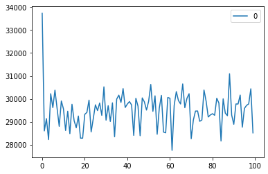
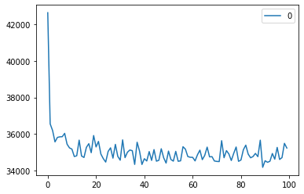

# Multiagent systems - TSP Problem

- Author: Antonio Sejas
- Sistemas Multiagente
- MUIA - UPM
- Julio 2020

In this jupyter notebook I've coded the Ant System, and ACO algorithm to resolve two TSP maps. It's interesting play with the parameters to fully understand the algorithm.

```python
import tsplib95
from random import randrange, random, shuffle
from bisect import bisect
import pandas as pd
import matplotlib.pyplot as plt
# import pixiedust
import numpy as np
```

```python
#!pip install ipython-autotime
%load_ext autotime
```

## Load TSP Problem

```python
# Data Source : http://www.math.uwaterloo.ca/tsp/world/countries.html
#TSP_FILE = 'uy734.tsp' # 🇺🇾 Uruguay
TSP_FILE = 'wi29.tsp' # 🇪🇭 Western Sahara
```

    time: 314 µs

```python
# LOAD TSP FILE
PROBLEM = tsplib95.load(TSP_FILE)
print(type(PROBLEM))
```

    <class 'tsplib95.models.StandardProblem'>
    time: 2.45 ms

```python
PROBLEM.type
```

    'TSP'


    time: 2.03 ms

```python
N = len(list(PROBLEM.get_nodes())) # N is total cities
print("%s Cities"%N)
```

    29 Cities
    time: 579 µs

```python
# Example city coordinates
PROBLEM.node_coords[3]
```

    [21300.0, 13016.6667]


    time: 1.34 ms

```python
# Distance between first and last cities
edge = {'start':1,'end':N}
PROBLEM.get_weight(**edge)
```

    7799


    time: 1.68 ms

## Basic Ant

```python
HALF_MATRIX = True
class Ant:
    tour = None
    tsp = PROBLEM

    def __init__(self, city_i=0):
        self.tour = []
        if city_i>0:
            self.visit(city_i)

    @property
    def current_city(self):
        return self.tour[-1]

    @property
    def tour_weight(self):
        return self.tsp.trace_tours([self.tour])[0]

    def visit(self, i:int):
        if i in self.tour and i != self.tour[0]:
            raise Exception("The city i: %s is already visited. Imposible to visit again"%i)
        if i < 1 or i > N:
            raise Exception("The city i (%s) is out of range: -> [1, %s]"%(i, N))
        self.tour.append(i)

    def distance_to(self, city_j:int):
        return self.tsp.get_weight(self.current_city, city_j)

    def _not_visited_cities(self):
        return [i for i in range(1,N+1) if i not in self.tour]

    def _raw_probability(self, city_j:int, pheromones_matrix):
        ## ASSUMPTION: We consider the edge has two ways. Phromones to go and to go back. In other words. I->J != J->I
        # careful, we must substract one from the cities index
        if HALF_MATRIX:
            a = min([self.current_city-1, city_j-1])
            b = max([self.current_city-1, city_j-1])
        else:
            a = self.current_city-1
            b = city_j-1
        return (pheromones_matrix[a][b]**ALPHA) * ((1/self.distance_to(city_j))**BETA)

    def normalized_probabilities(self, pheromones_matrix):
        """ Returns a tuple
            First element: List of neighbors, cities not visited
            Second element: List of probabilities calculated with the formular of tau_ij^A* h_ij^B
        """
        neighbors = self._not_visited_cities()
        neighbors_pheromone_list = [self._raw_probability(neighbor_j, pheromones_matrix) for neighbor_j in neighbors]
        total = sum(neighbors_pheromone_list)
        normalized_probabilities = [pheromone_ij/total for pheromone_ij in neighbors_pheromone_list]
        #print(normalized_probabilities)
        return neighbors, normalized_probabilities

    def pick_next_city(self, cities, probabilities):
        roulette_x = random()
        idx = 0
        roulette_sum = 0
        for p in probabilities:
            roulette_sum += p
            if roulette_sum >= roulette_x  :
                return cities[idx]
            idx += 1

    def finished_tour(self):
        return len(self.tour) == N

```

    time: 4.46 ms

```python
a = Ant(1)
print(a.tour)
a.visit(29)
print(a.tour)
print("Total weight of this ant tour is: %s"%a.tour_weight)
```

    [1]
    [1, 29]
    Total weight of this ant tour is: 15598
    time: 1 ms

```python
def plot_pheromones(df, step, show=True, title=''):
    print(title)
    if show:
        plt.imshow(df, cmap='hot', interpolation='nearest')
        plt.savefig("pheromones-%03d.png"%step)
        plt.show()
    #plt.imsave("pheromones-%03d.png"%step, df, cmap='hot')
```

    time: 736 µs

## BASE LINE

```python
# Solution joining all the cities in sequence
ant = Ant(1)
for i in range(2,N+1):
    ant.visit(i)
print(ant.tour)
print(ant.tour_weight)
```

    [1, 2, 3, 4, 5, 6, 7, 8, 9, 10, 11, 12, 13, 14, 15, 16, 17, 18, 19, 20, 21, 22, 23, 24, 25, 26, 27, 28, 29]
    52284
    time: 994 µs

```python
# Random Solution
ant = Ant(1)
random_cities = list(range(2,N+1))
shuffle(random_cities)
for i in random_cities:
    ant.visit(i)
print(ant.tour)
print(ant.tour_weight)
```

    [1, 22, 17, 10, 16, 19, 29, 27, 15, 25, 18, 4, 23, 11, 13, 28, 14, 2, 8, 24, 26, 12, 21, 20, 7, 3, 9, 5, 6]
    99557
    time: 1.21 ms

```python
# Solution using the heuristic
ant = Ant(1)
while not ant.finished_tour():
    neighbors = ant._not_visited_cities()
    distances = []
    for city_j in range(1, len(neighbors)+1):
        distances.append(ant.distance_to(city_j))
    pos_min_distance = distances.index(min(distances))
    next_closest_city = neighbors[pos_min_distance]
    ant.visit(next_closest_city)
print(ant.tour)
print(ant.tour_weight)
```

    [1, 2, 4, 7, 11, 16, 22, 29, 28, 27, 23, 26, 25, 24, 20, 21, 19, 18, 17, 14, 15, 13, 12, 8, 9, 6, 5, 10, 3]
    56645
    time: 3.67 ms

## ANT SYSTEM

```python
def ant_system(show=True):
    # INIT MATRIX for each CITY IJ with TAU INITIAL (t_0)
    _pheromones_row = [TAU_INITIAL for i in range(N)]
    pheromones_matrix = [_pheromones_row for j in range(N)]

    history_list = []

    for step in range(STEPS):
        ants_list = []
        for ant_i in range(M_ANTS):
            # pick a starting point
            first_random_city = randrange(N)+1
            ant = Ant(first_random_city)
            ants_list.append(ant)
            while not ant.finished_tour():
                # calculate probability P_j for all unvisited neightbors J
                    # ANT SYSTEM (AS): Probability of each edge in the neighborhood
                    # p_ij_k = (t_ij^a * (1/d_ij)^b ) / SUM(all feasible g edges) # It's like edge normalized
                neighbors, probabilities = ant.normalized_probabilities(pheromones_matrix) # sum(probabilities) == 1
                # pick the next node using the probabilities
                next_city = ant.pick_next_city(neighbors, probabilities)
                ant.visit(next_city)
            ant.visit(first_random_city) # Close cycle??
        history_list.append(ants_list.copy()) # save results
        # update pheromone values based upon the quality of each solution
            # ANT SYSTEM (AS): All ants contribute updating the pheromone as follows
            # TAU_I_J = (1-RO)*TAU_I_J + SUM(Q/(Lk or 0)) # Attention! In TSP Lk will be always the same == N Total cities
                                               # Probably in TSP the length means the distance
        pheromones_to_add = [[0 for i in range(N)] for j in range(N)]
        for ant in ants_list:
            tau_delta = Q/ant.tour_weight
            for tour_i in range(1, len(ant.tour)):
                i = ant.tour[tour_i-1]-1 # city
                j = ant.tour[tour_i]-1 # next city
                if HALF_MATRIX:
                    a = min([i,j])
                    b = max([i,j])
                else:
                    a = i
                    b = j
                pheromones_to_add[a][b] += tau_delta
        # update fermonones
        df = pd.DataFrame(pheromones_matrix)*(1-RO)+pd.DataFrame(pheromones_to_add)
        pheromones_matrix = df.values
        # PLOT every 10th of steps
        if step % int(STEPS/10) == 0:
            plot_pheromones(df,step=step+1, title="Step %s from %s."%(step+1,STEPS), show=show)
    # Plot last result
    plot_pheromones(df,step=step+1, title="Step %s from %s."%(step+1,STEPS), show=True)
    return history_list, ants_list
```

    time: 4 ms

```python
M_ANTS = int(N) # Number of ants ~ to number of nodes (N)
for m in N:
    M_ANTS
    ALPHA = 1 # History coefficietn ~ 1
    BETA = 3 # 0,1,2,3,4,5,6 # Heuristic Coefficient [2,5]
    RO = 0.2# Evaporation rate # It's like cooling. A high value is similar to very decrease the temparature drastically and get stucked in a local optimum
    Q = 1*30000 # Pheromone change factor
    TAU_INITIAL = 1/70000 # Initial pheromone ~ 1/RO*C^nn ; C^nn is the length of the tour generated by the nearest neighbor heuristic
    STEPS = 100

    history_list, ants_list = ant_system(show=False)
```

time: 9.19 s

```python
for m in range(1,N+1):
    M_ANTS = 2*m # Number of ants ~ to number of nodes (N)
    print("STARTING WITH %d ANTS:"%M_ANTS)
    ALPHA = 1 # History coefficietn ~ 1
    BETA = 3 # 0,1,2,3,4,5,6 # Heuristic Coefficient [2,5]
    RO = 0.2# Evaporation rate # It's like cooling. A high value is similar to very decrease the temparature drastically and get stucked in a local optimum
    Q = 1*30000 # Pheromone change factor
    TAU_INITIAL = 1/70000 # Initial pheromone ~ 1/RO*C^nn ; C^nn is the length of the tour generated by the nearest neighbor heuristic
    STEPS = 100

    history_list, ants_list = ant_system(show=False)

    #Results
    all_ants_list = [ant for ants_step_list in history_list for ant in ants_step_list]
    all_tours_weight_list = [a.tour_weight for a in all_ants_list]
    pos_min = all_tours_weight_list.index(min(all_tours_weight_list))
    print("Min weigth: %s"%all_tours_weight_list[pos_min])
    best_ant = all_ants_list[pos_min]
    best_tour = best_ant.tour
    print("Best Tour: %s"%best_tour)
```

    STARTING WITH 2 ANTS:


    Min weigth: 34342
    Best Tour: [21, 23, 22, 18, 19, 15, 10, 11, 12, 13, 9, 7, 3, 4, 5, 6, 1, 2, 8, 17, 16, 24, 27, 25, 26, 20, 14, 29, 28, 21]
    STARTING WITH 4 ANTS:


    Min weigth: 29835
    Best Tour: [17, 18, 19, 15, 11, 10, 12, 8, 4, 5, 1, 2, 6, 3, 7, 9, 13, 14, 16, 25, 27, 24, 20, 26, 28, 29, 21, 23, 22, 17]
    STARTING WITH 6 ANTS:


    Min weigth: 29033
    Best Tour: [22, 23, 21, 29, 28, 26, 20, 25, 27, 24, 16, 14, 13, 12, 10, 11, 6, 1, 2, 5, 4, 3, 7, 9, 8, 15, 19, 18, 17, 22]
    STARTING WITH 8 ANTS:


    Min weigth: 28453
    Best Tour: [15, 19, 18, 22, 23, 21, 29, 28, 26, 20, 16, 24, 27, 25, 17, 14, 13, 9, 7, 3, 4, 8, 5, 6, 2, 1, 11, 10, 12, 15]
    STARTING WITH 10 ANTS:


    Min weigth: 27811
    Best Tour: [9, 7, 3, 4, 8, 5, 6, 2, 1, 11, 10, 12, 15, 19, 18, 17, 21, 23, 22, 29, 28, 26, 20, 25, 27, 24, 16, 14, 13, 9]
    STARTING WITH 12 ANTS:


    Min weigth: 27935
    Best Tour: [15, 19, 18, 17, 22, 23, 21, 29, 28, 26, 20, 25, 27, 24, 16, 14, 13, 9, 7, 3, 4, 8, 5, 6, 1, 2, 10, 11, 12, 15]
    STARTING WITH 14 ANTS:


    Min weigth: 28453
    Best Tour: [19, 18, 22, 23, 21, 29, 28, 26, 20, 16, 24, 27, 25, 17, 14, 13, 9, 7, 3, 4, 8, 5, 6, 2, 1, 11, 10, 12, 15, 19]
    STARTING WITH 16 ANTS:


    Min weigth: 28253
    Best Tour: [10, 11, 15, 19, 18, 17, 21, 23, 22, 29, 28, 26, 20, 25, 27, 24, 16, 14, 13, 12, 8, 9, 7, 3, 4, 5, 6, 2, 1, 10]
    STARTING WITH 18 ANTS:


    Min weigth: 28763
    Best Tour: [15, 19, 18, 17, 21, 23, 22, 29, 28, 26, 20, 16, 25, 27, 24, 14, 13, 9, 7, 3, 4, 8, 5, 6, 1, 2, 11, 10, 12, 15]
    STARTING WITH 20 ANTS:


    Min weigth: 28377
    Best Tour: [22, 23, 21, 29, 28, 26, 20, 25, 27, 24, 16, 14, 13, 12, 8, 9, 7, 3, 4, 5, 6, 2, 1, 10, 11, 15, 19, 18, 17, 22]
    STARTING WITH 22 ANTS:


    Min weigth: 28181
    Best Tour: [17, 18, 19, 15, 11, 10, 6, 2, 1, 5, 4, 3, 7, 9, 8, 12, 13, 14, 16, 24, 27, 25, 20, 26, 28, 29, 21, 23, 22, 17]
    STARTING WITH 24 ANTS:


    Min weigth: 27749
    Best Tour: [17, 18, 19, 15, 12, 10, 11, 6, 2, 1, 5, 8, 4, 3, 7, 9, 13, 14, 16, 24, 27, 25, 20, 26, 28, 29, 21, 23, 22, 17]
    STARTING WITH 26 ANTS:


    Min weigth: 28424
    Best Tour: [15, 19, 18, 17, 21, 23, 22, 29, 28, 26, 20, 25, 27, 24, 16, 14, 13, 12, 8, 7, 9, 3, 4, 5, 6, 2, 1, 10, 11, 15]
    STARTING WITH 28 ANTS:


    Min weigth: 28670
    Best Tour: [24, 27, 25, 16, 20, 26, 28, 29, 21, 23, 22, 18, 19, 15, 12, 10, 11, 6, 2, 1, 5, 8, 4, 3, 7, 9, 13, 14, 17, 24]
    STARTING WITH 30 ANTS:


    Min weigth: 28252
    Best Tour: [26, 20, 25, 27, 24, 16, 14, 13, 12, 8, 9, 7, 3, 4, 5, 6, 1, 2, 10, 11, 15, 19, 18, 17, 21, 23, 22, 29, 28, 26]
    STARTING WITH 32 ANTS:


    Min weigth: 28042
    Best Tour: [19, 18, 17, 23, 22, 21, 29, 28, 26, 20, 25, 27, 24, 16, 14, 13, 9, 7, 3, 4, 8, 5, 6, 2, 1, 11, 10, 12, 15, 19]
    STARTING WITH 34 ANTS:


    Min weigth: 27811
    Best Tour: [13, 9, 7, 3, 4, 8, 5, 6, 2, 1, 11, 10, 12, 15, 19, 18, 17, 21, 23, 22, 29, 28, 26, 20, 25, 27, 24, 16, 14, 13]
    STARTING WITH 36 ANTS:


    Min weigth: 28454
    Best Tour: [14, 13, 9, 7, 3, 4, 8, 5, 6, 2, 1, 10, 11, 12, 15, 19, 18, 22, 23, 21, 29, 28, 26, 20, 16, 24, 27, 25, 17, 14]
    STARTING WITH 38 ANTS:


    Min weigth: 27612
    Best Tour: [16, 24, 27, 25, 20, 26, 28, 29, 23, 22, 21, 17, 18, 19, 15, 12, 10, 11, 6, 2, 1, 5, 8, 4, 3, 7, 9, 13, 14, 16]
    STARTING WITH 40 ANTS:


    Min weigth: 28252
    Best Tour: [15, 19, 18, 17, 21, 23, 22, 29, 28, 26, 20, 25, 27, 24, 16, 14, 13, 12, 8, 9, 7, 3, 4, 5, 6, 1, 2, 10, 11, 15]
    STARTING WITH 42 ANTS:


    Min weigth: 28226
    Best Tour: [14, 13, 9, 7, 3, 4, 8, 5, 6, 2, 1, 11, 10, 12, 15, 19, 18, 22, 23, 21, 29, 28, 26, 20, 25, 27, 24, 16, 17, 14]
    STARTING WITH 44 ANTS:


    Min weigth: 28257
    Best Tour: [29, 28, 26, 20, 25, 27, 24, 16, 14, 13, 9, 7, 3, 4, 8, 5, 2, 1, 6, 10, 11, 12, 15, 19, 18, 22, 23, 21, 17, 29]
    STARTING WITH 46 ANTS:


    Min weigth: 28406
    Best Tour: [19, 18, 22, 23, 21, 29, 28, 26, 24, 27, 25, 16, 20, 17, 14, 13, 9, 7, 3, 4, 8, 5, 6, 1, 2, 11, 10, 12, 15, 19]
    STARTING WITH 48 ANTS:


    Min weigth: 27946
    Best Tour: [19, 18, 17, 21, 23, 22, 29, 28, 26, 20, 27, 25, 24, 16, 14, 13, 9, 7, 3, 4, 8, 5, 6, 2, 1, 11, 10, 12, 15, 19]
    STARTING WITH 50 ANTS:


    Min weigth: 27811
    Best Tour: [14, 13, 9, 7, 3, 4, 8, 5, 6, 2, 1, 11, 10, 12, 15, 19, 18, 17, 21, 23, 22, 29, 28, 26, 20, 25, 27, 24, 16, 14]
    STARTING WITH 52 ANTS:


    Min weigth: 27811
    Best Tour: [14, 13, 9, 7, 3, 4, 8, 5, 6, 1, 2, 10, 11, 12, 15, 19, 18, 17, 21, 23, 22, 29, 28, 26, 20, 25, 27, 24, 16, 14]
    STARTING WITH 54 ANTS:


    Min weigth: 28228
    Best Tour: [15, 19, 18, 17, 21, 23, 22, 29, 28, 26, 20, 25, 27, 24, 16, 14, 13, 12, 8, 7, 9, 3, 4, 5, 1, 2, 6, 10, 11, 15]
    STARTING WITH 56 ANTS:


    Min weigth: 28203
    Best Tour: [17, 18, 19, 15, 12, 10, 11, 6, 2, 1, 5, 4, 8, 7, 3, 9, 13, 14, 16, 24, 27, 25, 20, 26, 28, 29, 21, 23, 22, 17]
    STARTING WITH 58 ANTS:


    Min weigth: 27749
    Best Tour: [23, 21, 29, 28, 26, 20, 25, 27, 24, 16, 14, 13, 9, 7, 3, 4, 8, 5, 1, 2, 6, 11, 10, 12, 15, 19, 18, 17, 22, 23]
    time: 7min 33s

```python
tours_weight_list = [a.tour_weight for a in ants_list]
print(tours_weight_list)
```

    [41452, 34264, 31520, 31167, 32841, 30794, 33718, 35413, 34299, 35205, 35409, 36502, 32727, 35078, 32767, 31543, 31218, 37909, 40431, 30039, 32038, 38803, 39163, 31978, 36819, 37753, 31793, 33751, 36302, 42885, 31795, 35961, 31886, 40050, 30739, 28512, 34902, 34616, 35421, 41793, 39343, 36512, 33163, 40943, 39181, 36074, 32207, 35010, 29991, 29966, 39768, 36854, 37645, 38673, 41095, 32418, 39090, 34212]
    time: 9.53 ms

```python
#pos_min = tours_weight_list.index(min(tours_weight_list))
all_ants_list = [ant for ants_step_list in history_list for ant in ants_step_list]
all_tours_weight_list = [a.tour_weight for a in all_ants_list]
pos_min = all_tours_weight_list.index(min(all_tours_weight_list))
print("Min weigth: %s"%all_tours_weight_list[pos_min])
best_ant = all_ants_list[pos_min]
best_tour = best_ant.tour
print("Best Tour: %s"%best_tour)
```

    Min weigth: 27749
    Best Tour: [23, 21, 29, 28, 26, 20, 25, 27, 24, 16, 14, 13, 9, 7, 3, 4, 8, 5, 1, 2, 6, 11, 10, 12, 15, 19, 18, 17, 22, 23]
    time: 872 ms

```python
pd.DataFrame(all_tours_weight_list).plot(figsize=(15,10))
```

    <matplotlib.axes._subplots.AxesSubplot at 0x7fe5eaebe890>


    time: 417 ms

```python
pd.DataFrame([min([a.tour_weight for a in ants_step_list]) for ants_step_list in history_list]).plot()
```

    <matplotlib.axes._subplots.AxesSubplot at 0x7fe5ed252510>



    time: 1.01 s

```python
pd.DataFrame([max([a.tour_weight for a in ants_step_list]) for ants_step_list in history_list]).plot()
```

    <matplotlib.axes._subplots.AxesSubplot at 0x7fe5ec0923d0>


    time: 1 s

```python
pd.DataFrame([np.mean([a.tour_weight for a in ants_step_list]) for ants_step_list in history_list]).plot()
```

    <matplotlib.axes._subplots.AxesSubplot at 0x7fe5ec2de590>



    time: 1 s

```python
map_df_lat = pd.DataFrame([PROBLEM.node_coords[i][0] for i in best_tour], columns=['lat'])
map_df_long = pd.DataFrame([PROBLEM.node_coords[i][1] for i in best_tour], columns=['long'])*-1
print(len(map_df_lat))
plt.figure(figsize=(15,10))
plt.plot(map_df_long,
              map_df_lat,
              c='DarkBlue',
              #style=['o', 'rx'],
              #s=2,
              #figsize=(15,8),
              marker="o",
              markerfacecolor="r")
```

    30


    [<matplotlib.lines.Line2D at 0x7fe5ee7a5590>]


    time: 210 ms

```python

```

```python
best_ant.tour_weight
```

    27749


    time: 1.83 ms

```python

```

```python

```
